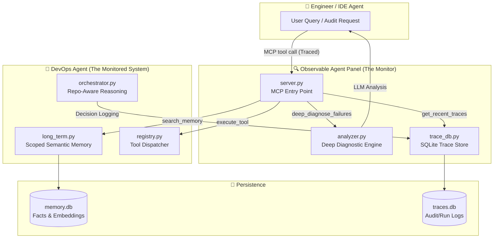
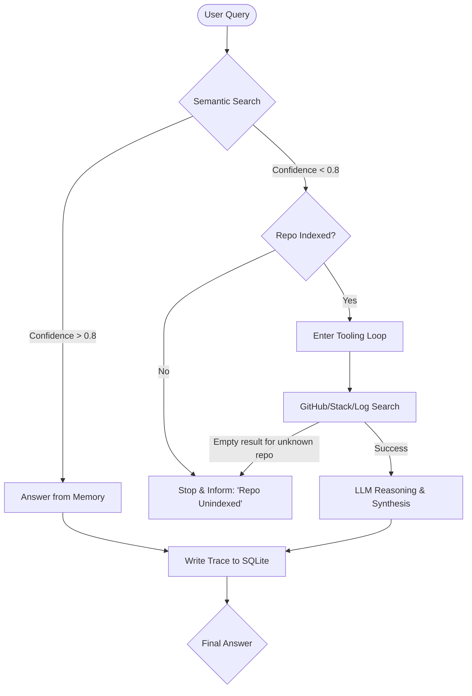
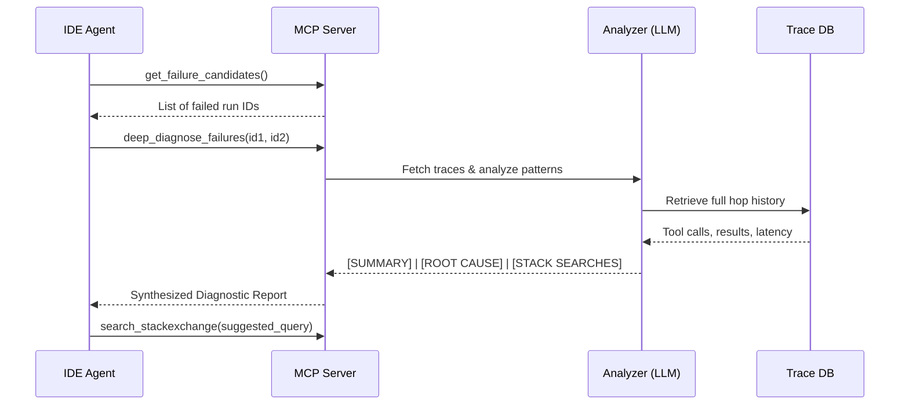

# System Workflow & Logic — Observable Agent Control Panel

This document details the end-to-end operational workflow of the system, from initial user query to automated self-healing and deep failure diagnosis.

## 1. High-Level Component Map

The project is architecturally split into two halves: the **Executing Agent** (Monitored) and the **Control Panel** (Monitor).

## 2. The Decision Workflow (Knowledge Boundary)

The `Orchestrator` uses a "Token-Optimized" decision tree with strict knowledge scoping to prevent hallucinations and infinite loops.

## 3. The Self-Healing Workflow (Deep Analysis)

When multiple runs fail or performance degrades, the system triggers an LLM-powered deep dive:

## 4. Operational Modes & Advanced Commands

| Mode | Command | Best For |
|---|---|---|
| **CLI (REPL)** | `python -m devops_agent.main --mode cli` | Interactive use, debugging, and real-time observability. |
| **Server (MCP)** | `python -m devops_agent.main --mode server` | Cursor/Antigravity integration with automatic trace logging. |

### Diagnostic Commands (REPL & Shell)
- **`--traces [N]`**: List the last N run IDs and their outcomes.
- **`--explain <ID>`**: Render the agent's internal reasoning as Markdown.
- **`--compare <ID1> <ID2>`**: Side-by-side structural comparison of two runs.
- **`--deep-analyze <IDs>`**: (New) LLM-powered pattern analysis across multiple failures.

## 5. Visibility & Persistence

*   **MCP Tracing**: Every tool call made by the IDE (e.g., `search_memory`) is now automatically recorded as a trace.
*   **`data/memory.db`**: Stores vector-based semantic facts (PRs, Issues).
*   **`data/traces.db`**: Stores every step taken by the agent for later auditing.
*   **`.env`**: Holds `GROQ_API_KEY`, `GITHUB_TOKEN`, and `HF_TOKEN`.
